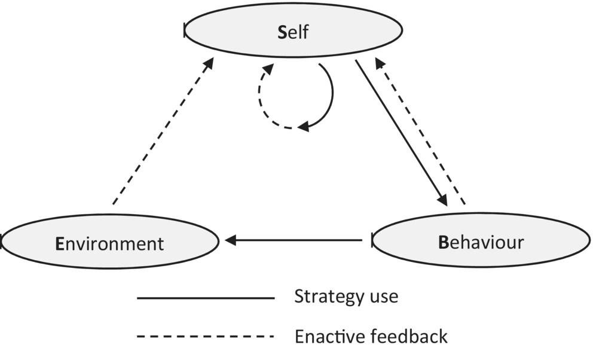
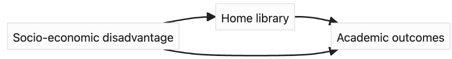

# Presenter notes

## 0. Assumptions

-   The Fisher Inoculation: It is ok to talk about causes.
-   We care about causes in learning.

## 1. Why (part 1 - no cause without knowledge)

Given, X = {1,2,3,4} and Y = {2,4,6,8}, what might you say about the two variables?

-   Are they associated?
-   What is their relationship?
-   Is it $X \rightarrow 2X=Y$ or $Y \rightarrow Y/2 = X$? Did you make a claim? What hidden assumptions were there? (order of writing, X before Y, doubling instead of halving)

Any data-driven approach falls short here. Knowledge must come from outside the system.

## 2. What

### Systems maps (Causal DG)

-   System maps (causal map, graphical causal model, ...) are used for a range of things. Nodes, edges indicating cause, additional info on edges (weight, polarity, function). Directed graphs.

### Causal DAGs

-   DAGs are a specific form of a system map: Acyclic, no edge feature other than direction. Have a very nice mathematical interpretation. This has nice affordances in translating to machines / mathematics.

### Analysing - connecting to conditional independence

#### Connected dyads always dependent

#### Chain

#### Fork

#### Collider

## 3 Why (part 2 - affordances)

You build it, then what?

### The map is not the territory, but the right map is useful

### Qualitative reasoning about interventions

This can be done with Systems Maps just fine, does not need the DAG

### Simulation

This can be done in a variety of ways, such as agent-based models for any of the maps, or data generating processes for the DAGs. 

### Causal inference / debiasing

Using the DAG to find adjustment sets for causal inference or minimising bias in ML models.

### System (i.e. LA) design

Using the adjustment sets to provide design advice - knowing what to include with what on a dashboard for instance (i.e. filters and slices in comparison graphs).

## 4. How

There is no agreed way. 

However, here are some guiding principles:

### No connection is a strong assumption

### Think in paths

Each path is a chain of events that could tell a story. Jump in and out of examples / scenarios and the general rule. 

### Bounding

How wide does the model go? What get's included in the model?

This might be temporal bounding - for instance SES of parents

### Depth

How detailed is the model? Do some nodes need to be merged? Should some be split?

## 5. Do - draw with pens

## 6. Now what - implications with DAGitty

## 7. Reflect
