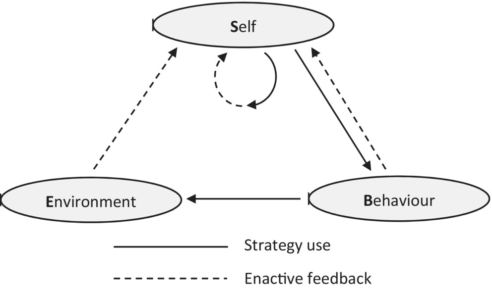

Presenter notes - ALASI24
================
Ben Hicks

- [Presenter notes](#presenter-notes)
  - [0. Assumptions](#0-assumptions)
  - [1. Why (part 1 - no cause without
    knowledge)](#1-why-part-1---no-cause-without-knowledge)
  - [2. What](#2-what)
    - [Systems maps (Causal DG)](#systems-maps-causal-dg)
    - [Causal DAGs](#causal-dags)
    - [Analysing - connecting to conditional
      independence](#analysing---connecting-to-conditional-independence)
  - [3 Why (part 2 - affordances)](#3-why-part-2---affordances)
    - [Qualitative reasoning about
      interventions](#qualitative-reasoning-about-interventions)
    - [Simulation](#simulation)
    - [Causal inference / debiasing](#causal-inference--debiasing)
    - [System (i.e. LA) design](#system-ie-la-design)
  - [4. How](#4-how)
    - [No connection is a strong
      assumption](#no-connection-is-a-strong-assumption)
    - [Think in paths](#think-in-paths)
    - [Bounding](#bounding)
    - [Depth](#depth)

# Presenter notes

## 0. Assumptions

- The Fisher Inoculation: It is ok to talk about causes.
- We care about causes in learning.

## 1. Why (part 1 - no cause without knowledge)

Given, X = {1,2,3,4} and Y = {2,4,6,8}, what might you say about the two
variables?

- Are they associated?
- What is their relationship?
- Is it $X \rightarrow 2X=Y$ or $Y \rightarrow Y/2 = X$? Did you make a
  claim? What hidden assumptions were there? (order of writing, X before
  Y, doubling instead of halving)

Any data-driven approach falls short here. Knowledge must come from
outside the system.

## 2. What

### Systems maps (Causal DG)

- System maps (causal map, graphical causal model, …) are used for a
  range of things. Nodes, edges indicating cause, additional info on
  edges (weight, polarity, function). Directed graphs.

<figure>

<figcaption aria-hidden="true">Example of a systems map.
(SRL)</figcaption>
</figure>

### Causal DAGs

- DAGs are a specific form of a system map: Acyclic, no edge feature
  other than direction. Have a very nice mathematical interpretation.
  This has nice affordances in translating to machines / mathematics.

<figure>

<figcaption aria-hidden="true">Example of a DAG</figcaption>
</figure>

<figure>

<figcaption aria-hidden="true">Example of a DAG with augmented
edges</figcaption>
</figure>

### Analysing - connecting to conditional independence

#### Connected dyads always dependent

#### Chain

#### Fork

#### Collider

## 3 Why (part 2 - affordances)

You build it, then what?

### Qualitative reasoning about interventions

This can be done with Systems Maps just fine, does not need the DAG

### Simulation

This can be done in a variety of ways, such as agent-based models for
any of the maps, or data generating processes for the DAGs.

### Causal inference / debiasing

Using the DAG to find adjustment sets for causal inference or minimising
bias in ML models.

### System (i.e. LA) design

Using the adjustment sets to provide design advice - knowing what to
include with what on a dashboard for instance (i.e. filters and slices
in comparison graphs).

## 4. How

There is no agreed way.

However, here are some guiding principles:

### No connection is a strong assumption

### Think in paths

Each path is a chain of events that could tell a story. Jump in and out
of examples / scenarios and the general rule.

### Bounding

How wide does the model go? What get’s included in the model?

### Depth

How detailed is the model? Do some nodes need to be merged? Should some
be split?
