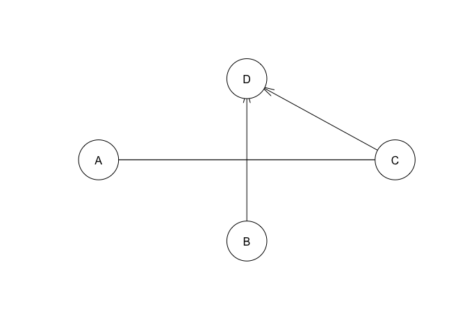
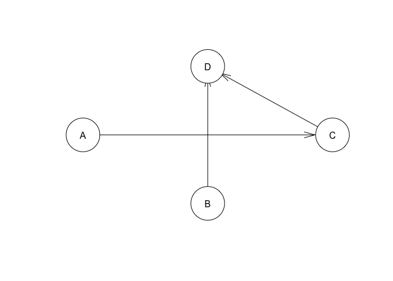
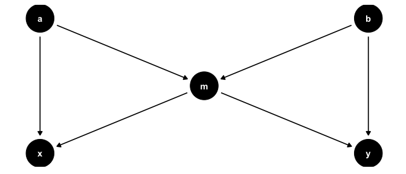

Causal Modelling Workshop - ALASI24
================
Ben Hicks

- [Code examples](#code-examples)
  - [Causal discovery](#causal-discovery)
    - [With `bnlearn` in R](#with-bnlearn-in-r)
    - [With `CausalNex` in Python](#with-causalnex-in-python)
- [Outline of workshop](#outline-of-workshop)
  - [Overview](#overview)
    - [How can Causal Models help minimise
      bias?](#how-can-causal-models-help-minimise-bias)
    - [How can Causal Models help in the co design of
      LA?](#how-can-causal-models-help-in-the-co-design-of-la)
    - [What will I learn?](#what-will-i-learn)
    - [About the facilitator](#about-the-facilitator)
  - [Preparation](#preparation)
    - [Optional: Think of a problem](#optional-think-of-a-problem)
    - [Optional: Further reading](#optional-further-reading)
    - [Very very optional: R installation and
      packages](#very-very-optional-r-installation-and-packages)

The workshop notes are available
[here](https://sites.google.com/view/alasi24-ccm/home), this space has a
brief description of the workshop and examples of code. My presenter
notes are availble [here in this
repo](https://github.com/benwhicks/ALASI24-causal-modelling-workshop/blob/main/presenter-notes.md).

# Code examples

## Causal discovery

### With `bnlearn` in R

``` r
library(tidyverse)
```

    ## ── Attaching core tidyverse packages ──────────────────────── tidyverse 2.0.0 ──
    ## ✔ dplyr     1.1.4     ✔ readr     2.1.5
    ## ✔ forcats   1.0.0     ✔ stringr   1.5.1
    ## ✔ ggplot2   3.5.0     ✔ tibble    3.2.1
    ## ✔ lubridate 1.9.3     ✔ tidyr     1.3.1
    ## ✔ purrr     1.0.2     
    ## ── Conflicts ────────────────────────────────────────── tidyverse_conflicts() ──
    ## ✖ dplyr::filter() masks stats::filter()
    ## ✖ dplyr::lag()    masks stats::lag()
    ## ℹ Use the conflicted package (<http://conflicted.r-lib.org/>) to force all conflicts to become errors

``` r
library(bnlearn)

# creating some sample data
N <- 50
noise_size <- 3
d <- tibble(
    A = sample(1:10, N, replace = TRUE),
    B = sample(2:8, N, replace = TRUE)) |> 
    mutate(A = A/1.1, B = B / 1.2) |> 
    mutate(C = 2 * A + noise_size * rnorm(N)) |> 
    mutate(D = C + 3 * B - A + noise_size * rnorm(N)) 

true_dag <- tibble(
    from = c("A", "C", "A"),
    to = c("C", "D", "D")
)

bn_struct <- gs(d)
plot(bn_struct)
```

<!-- -->

``` r
# what if we know that C does not cause A?
bl = matrix(c("C", "A"), ncol = 2, byrow = TRUE)
bn_struct2 <- gs(d, blacklist = bl)
plot(bn_struct2)
```

<!-- -->

### With `CausalNex` in Python

Not working yet…

``` python
# required packages
%pip install causalnex
%pip install graphviz
```

``` python
import numpy as np
import pandas as pd
from causalnex.structure import StructureModel
from causalnex.structure.notears import from_pandas

# Sample data (replace with your own data)
data = pd.DataFrame({
    'A': np.random.rand(100),
    'B': np.random.rand(100),
    'C': np.random.rand(100),
    'D': np.random.rand(100),
})
data['B'] = data['A'] * 2 + np.random.rand(100)  # Introduce a causal relationship
data['C'] = data['B'] * 0.5 + np.random.rand(100)
data['D'] = data['C'] + data['A'] + np.random.rand(100)


# Learn the causal structure using the NOTEARS algorithm
sm = StructureModel()
sm = from_pandas(data)

# Print the adjacency matrix (representing the learned causal graph)
sm.adj_matrix_

# Visualize the graph (requires installing graphviz)
# You can uncomment this if you have graphviz installed
# sm.plot()
```

# Outline of workshop

## Overview

We will explore how drawing diagrams such as the one below, called DAGs,
can help understand causality and potential sources of bias (the DAG
below is known as the ‘butterfly bias’).

<!-- -->

### How can Causal Models help minimise bias?

Causal Models help encode our scientific assumptions in a formalised
way. This graphical formalisation, the causal Directed Acyclic Graph
(DAG), is both easy to interpret by non-technical experts and directly
translatable to statistical modellers. By leveraging the rigorous
mathematical machinery underneath the DAG (see [Pearl and
McKenzie](https://www.goodreads.com/en/book/show/36204378), or
[Rohrer](https://journals.sagepub.com/doi/pdf/10.1177/2515245917745629),
[Lubke et
al.](https://www.tandfonline.com/doi/full/10.1080/10691898.2020.1752859),
for a good introduction) we can build a statistical model that is
designed to minimise bias in the system, based on our clearly
articulated assumptions, in order to make a causal estimate.

For a deeper introduction to causal models and bias, see:

> Weidlich, J., Gašević, D., & Drachsler, H. (2022). [Causal Inference
> and Bias in Learning Analytics: A Primer on Pitfalls Using Directed
> Acyclic
> Graphs](https://learning-analytics.info/index.php/JLA/article/view/7577).
> *Journal of Learning Analytics*, 9(3), 183-199.

### How can Causal Models help in the co design of LA?

These models are drawn, using pen and paper or online tools such as
[DAGitty](http://www.dagitty.net/), and are much easier to interpret for
the non-technical expert than a statistical model. As such they provide
an opportunity to include non-technical experts in the design process of
LA and other research.

For a deeper introduction to causal models as a participatory design
tool, see:

> Hicks, B., Kitto, K., Payne, L., & Buckingham Shum, S. (2022, March).
> [Thinking with causal models: A visual formalism for collaboratively
> crafting
> assumptions](https://dl.acm.org/doi/abs/10.1145/3506860.3506899). In
> *LAK22: 12th International Learning Analytics and Knowledge
> Conference* (pp. 250-259).

### What will I learn?

- Enough theoretical background knowledge to draw your own DAG
- General tips for constructing causal models
- Overview of available tools to help with causal modelling and
  inference

### About the facilitator

**Ben Hicks** → [twitter](https://twitter.com/benimbenix),
[blog](https://koanmathematics.wordpress.com/)

Ben Hicks is a doctoral researcher with the Connected Intelligence
Centre ([UTS:CIC](https://cic.uts.edu.au/)) at the University of
Technology Sydney. His research centres around the participatory and
scrutable modelling of learning systems, primarily using graphical
causal models as a tool for engagement and collaboration. Ben has worked
as a teacher for over a decade across three continents before switching
to building models and data pipelines to assist in student support and
retention.

## Preparation

The workshop is designed to allow for two streams: those interested in a
general introduction into causal modelling and applications using pen
and paper, and those also interested in the coding of the models,
primarily using R. *Pen and paper is fine*, there is no need to delve
into the code unless this is already an area of interest. Some of the
benefits of using software packages are also available in a web based
graphical tool called [Dagitty](http://www.dagitty.net/), which will
also be covered.

### Optional: Think of a problem

Do you have a problem in your research or work where it would help to
understand a *causal* effect? It may be an intervention that has been
performed, or perhaps proposed, whose impact is difficult to untangle
from other parts of the learning system (LA examples are available our
papers, outlined below in *Further reading*). If you can think of a
problem, bring it along to the session for a chance to work
collaboratively on minimising the bias in estimating the causal effect
through the development of a causal model.

### Optional: Further reading

We have already shamelessly plugged our papers, but here they are again:
[Thinking with causal
models](https://dl.acm.org/doi/abs/10.1145/3506860.3506899) and [Causal
Inference and Bias in Learning
Analytics](https://learning-analytics.info/index.php/JLA/article/view/7577).
[The Book of Why](https://www.goodreads.com/en/book/show/36204378) is a
very readable introduction to the use of graphical causal models and why
they are important for science.

### Very very optional: R installation and packages

If you are interested in following some of the code examples we may
cover, then make sure you have R (and preferably RStudio) installed
prior to the workshop. The following code will install the required
packages:

``` r
install.packages("tidyverse")
install.packages("dagitty")
install.packages("bnlearn")
```
